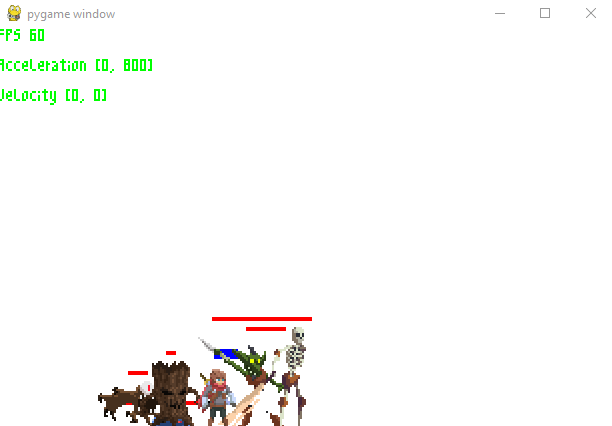

# indie-game-concept
This is a project for an infinite world indie game concept I'm starting to build with Python and Pygame

# Development Logs
__Dev Release 0.1.0 - 6/09/20 - Initial__

1. What's Implemented
    - Player States (Idle, walk, run, crouch, etc...)
    - Melee Combat (Punch, kick)
    - Sword Combat
    - Spell Casting (Effects not Implemented)
    - Font rendering system (thanks to DaFluffyPotato)
    - Physics engine for gravity, friction, etc...
    - Animation engine

2. In action  

 
 

__Dev Release 0.2.0 - 5/10/20 - Enemy Release__

1. What's Implemented
    - Enemy entities (Bat, Eye, Goblin, Skeleton, Mushroom, etc.)
    - Enemy state management (attack, idle, move)
    - Functionality to track player location and update state accordingly
    - Enemy combat

2. In action  

